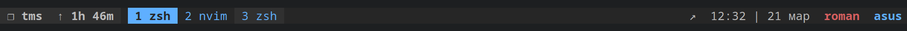

.tmux
=====

This is a fork of the [oh-my-tmux](https://github.com/gpakosz/.tmux)



## Installation

Requirements:

- tmux **`>= 2.4`** running inside Linux, Mac, OpenBSD, Cygwin or WSL
- awk, perl and sed
- outside of tmux, `$TERM` must be set to `xterm-256color`

⚠️ Before installing, you may want to backup your existing configuration.

You can install Oh my tmux! at any of the following locations:

- `~`
- `$XDG_CONFIG_HOME/tmux`
- `~/.config/tmux`

Installing in `~`:

```bash
cd
git clone https://github.com/axemanofic/.tmux
ln -s -f .tmux/.tmux.conf
cp .tmux/.tmux.conf.local .
```

Installing in `$XDG_CONFIG_HOME/tmux`:

```bash
git clone https://github.com/axemanofic/.tmux "/path/to/oh-my-tmux"
mkdir -p "$XDG_CONFIG_HOME/tmux"
ln -s "/path/to/oh-my-tmux/.tmux.conf" "$XDG_CONFIG_HOME/tmux/tmux.conf"
cp "/path/to/oh-my-tmux/.tmux.conf.local" "$XDG_CONFIG_HOME/tmux/tmux.conf.local"
```

Installing in `~/.config/tmux`:

```bash
git clone https://github.com/axemanofic/.tmux "/path/to/oh-my-tmux"
mkdir -p "~/.config/tmux"
ln -s "/path/to/oh-my-tmux/.tmux.conf" "~/.config/tmux/tmux.conf"
cp "/path/to/oh-my-tmux/.tmux.conf.local" "~/.config/tmux/tmux.conf.local"
```

If you have any problems contact [here](https://github.com/gpakosz/.tmux.git)

## Features

- Color-schema [Github Dark dimmed](https://primer.style/primitives/colors)
- Plugin [tmux-plugins/tmux-continuum](https://github.com/tmux-plugins/tmux-continuum)

## From the author

Thank you for using this color scheme. 
If you like it please like it :heart:
